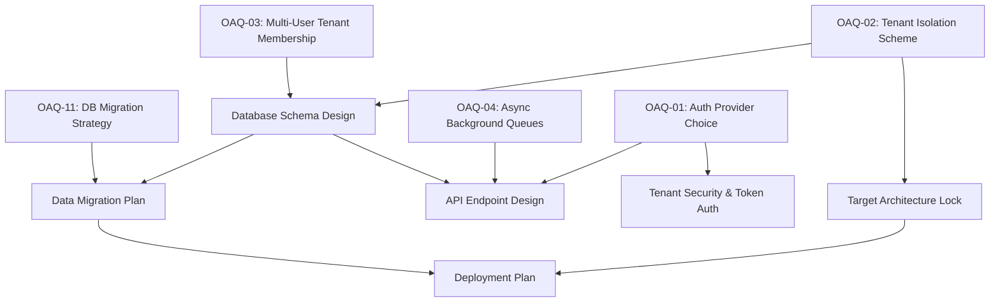

# ADR-000: Current-State Findings and Architecture Decision Register

## 1. Executive Summary

This Architecture Decision Register (ADR) establishes an authoritative, evidence-backed foundation for the transition of the BuildHub prototype into the production **BuildEstimate BOS (Business Operating System)**. By auditing five distinct current-state sub-system reviews and aligning them with the approved Product Requirements Document (PRD), this document separates proven engineering realities from planned target states, eliminating speculation and design bleed during the upcoming architectural phase.

### Register Metric Summary
*   **Proven Current-State Facts**: 27
*   **Locked Product Decisions**: 11
*   **Proposed Technical Decisions**: 15
*   **Open Architecture Questions**: 12
*   **Architecture Contradictions Identified**: 7

### Major Design Blockers
1.  **Identity & Token Verification Scheme**: The Express backend is currently blind to user authentication. Transitioning requires a formal mechanism to intercept and verify client-supplied tokens.
2.  **Multi-Tenant Isolation Strategy**: Selecting between database-level PostgreSQL Row-Level Security (RLS) and application-level middleware query-injection.
3.  **Prospect Model Normalization**: Resolving the dual-representation of leads (`crm_leads` and `leads`) and deduplicating customer profiles without losing historical assignment records or generating fabricated activities.

---

## 2. Evidence Hierarchy

To resolve structural conflicts during target design, the following order of authority is established. Lower-level sources are strictly forbidden from overriding higher-level layers, and design decisions must trace upwards to approved product rules:

```
┌─────────────────────────────────────────┐
│ 1. Approved Product Requirements (PRD)  │
└────────────────────┬────────────────────┘
                     ▼
┌─────────────────────────────────────────┐
│ 2. Approved Architecture Decisions (ADR)│
└────────────────────┬────────────────────┘
                     ▼
┌─────────────────────────────────────────┐
│ 3. Approved Design Specifications       │
└────────────────────┬────────────────────┘
                     ▼
┌─────────────────────────────────────────┐
│ 4. Repository Evidence                  │
└────────────────────┬────────────────────┘
                     ▼
┌─────────────────────────────────────────┐
│ 5. Audit Analysis & Inventory           │
└────────────────────┬────────────────────┘
                     ▼
┌─────────────────────────────────────────┐
│ 6. Technical Recommendations            │
└─────────────────────────────────────────┘
```

Lower-level layers (such as code audits or technology suggestions) represent the current-state baseline and cannot silently alter approved business objectives (such as server-authoritative state transitions or mandatory next actions).

---

## 3. Proven Current-State Facts Register

The following numbered register identifies current engineering realities verified directly from the BuildHub repository:

### FACT-01: Dual-Persistence Paths
*   **Statement**: The application operates a divided dual-persistence path. Authenticated sessions synchronize states directly to Firestore via client-side queries, while unauthenticated guest sessions use Express REST proxies to read/write to a local `db.json` file.
*   **Evidence Source**: `docs/current-state/PERSISTENCE-AUDIT.md` (Section 1.1) and `src/App.tsx` (lines 384–395).
*   **Confidence**: HIGH
*   **Architecture Impact**: Critical split-brain vulnerability. Changes made in guest mode do not sync with Firestore and vice-versa, leading to severe data divergence.

### FACT-02: Client-Direct Google Authentication
*   **Statement**: User authentication is executed directly in the browser via a Firebase Client SDK popup. The resulting authenticated session remains local to the frontend.
*   **Evidence Source**: `src/lib/firebase.ts` (lines 17–22) and `src/App.tsx` (lines 398–406).
*   **Confidence**: HIGH
*   **Architecture Impact**: Bypasses centralized backend control, making the backend server entirely blind to active user authentication states.

### FACT-03: Express Backend Blind to Auth
*   **Statement**: The Express server lacks JWT token validation middleware. No endpoints inspect token claims or verify authorization headers for incoming requests.
*   **Evidence Source**: `server/index.ts` (wildcard and API route routing layouts).
*   **Confidence**: HIGH
*   **Architecture Impact**: Complete absence of server-mediated data isolation. Endpoints rely entirely on client-side compliance to prevent data leakage.

### FACT-04: Unsecured Database Overwrite Endpoint (`POST /api/db`)
*   **Statement**: The backend exposes an unsecured API endpoint that accepts a raw JSON payload in bulk and immediately overwrites the global `db.json` file on disk without validation or authentication.
*   **Evidence Source**: `/server/routes/db.ts` (lines 11–15).
*   **Confidence**: HIGH
*   **Architecture Impact**: Critical vulnerability. Any internet client can issue a HTTP POST request and completely wipe, corrupt, or alter the corporate system of record.

### FACT-05: Direct Firestore Client Mutations
*   **Statement**: The React frontend imports Firestore mutation SDK methods and executes writes, reads, and deletions directly on cloud subcollections without backend mediation.
*   **Evidence Source**: `src/App.tsx` (lines 25, 170–183).
*   **Confidence**: HIGH
*   **Architecture Impact**: Exposes database paths and schemas directly to the browser. Prevents centralized enforcement of transaction boundaries and business validation rules.

### FACT-06: Schema Key and Path Naming Mismatches
*   **Statement**: Severe structural mismatches exist between Client state properties and Firestore path names: client-side `buyer_requirements` maps to `/leads`, client-side `leads` maps to `/crm_leads`, and client-side `crm_leads` maps to `/construction_inquiries`.
*   **Evidence Source**: `docs/current-state/PERSISTENCE-AUDIT.md` (Section 3).
*   **Confidence**: HIGH
*   **Architecture Impact**: High risk of database schema misalignment or critical field loss if data is migrated without mapping conversions.

### FACT-07: In-Memory Volatile Round-Robin Allocation Index
*   **Statement**: The sequential allocation offset pointer (`globalRoundRobinIndex`) is stored as a volatile in-memory Javascript module variable.
*   **Evidence Source**: `src/lib/CRMLeadEngine.ts` (line 103).
*   **Confidence**: HIGH
*   **Architecture Impact**: Pointer resets to `0` whenever the browser window is refreshed or the server container is recycled, causing duplicate assignments and unfair lead distributions.

### FACT-08: Client-Controlled Persona Switcher
*   **Statement**: System access and active UI perspectives are controlled by a client-side dropdown (`activeRole`) that can be manually mutated on the fly by any user.
*   **Evidence Source**: `src/components/Navigation.tsx` (lines 105–125).
*   **Confidence**: HIGH
*   **Architecture Impact**: Flawed client-side security model. Changing the dropdown changes UI tabs and log metadata, but does not provide cryptographically secure backend permission boundaries.

### FACT-09: Unsecured Client-Side Tenant Identity Derivation
*   **Statement**: Multi-tenant isolation is client-orchestrated. The React client derives the active tenant identifier from the client-side Google auth UID, appending it to outbound payloads and Firestore queries manually.
*   **Evidence Source**: `src/App.tsx` (lines 187–234).
*   **Confidence**: HIGH
*   **Architecture Impact**: Vulnerable to client-side payload manipulation. Users can access records belonging to other companies by altering local variables in the browser.

### FACT-10: Coexistence of Divided Lead Schemas
*   **Statement**: Two separate, disjointed prospect structures coexist in the database: the legacy `Lead` model (flat, loaded in Pipeline Kanban boards) and the modern `CRMLead` model (nested, loaded in the CRM Inquiry Hub).
*   **Evidence Source**: `src/types.ts` (lines 217–251).
*   **Confidence**: HIGH
*   **Architecture Impact**: Divided views, duplicate profiles, and fragmented status trackers that prevent a unified sales funnel.

### FACT-11: Absence of Phone Number Duplicate Handling
*   **Statement**: No validation checks exist to intercept duplicate inquiries. Registering or posting identical customer phone numbers creates multiple, isolated `CRMLead` entries.
*   **Evidence Source**: `docs/current-state/UI-WORKFLOW-BUSINESS-RULE-AUDIT.md` (Section 14).
*   **Confidence**: HIGH
*   **Architecture Impact**: Rapid database bloat and division of the historical interaction timeline across multiple duplicate cards.

### FACT-12: Client-Side WhatsApp Dispatch Simulation
*   **Statement**: External WhatsApp notifications are triggered directly from the user's browser, making HTTP POST requests to a simulated Meta endpoint using a hardcoded, fake Bearer token.
*   **Evidence Source**: `src/lib/CRMLeadEngine.ts` (lines 99–132).
*   **Confidence**: HIGH
*   **Architecture Impact**: High security risk. Moving to production would require exposing real Meta credentials to the client browser.

### FACT-13: Active-Status Round-Robin Allocator Filters
*   **Statement**: The round-robin allocation engine filters profiles with a user_role of `'Telecaller'` and an account_status of `'Active'`. It does not verify logged-in presence or real-time session activity.
*   **Evidence Source**: `src/lib/CRMLeadEngine.ts` (lines 11–15).
*   **Confidence**: HIGH
*   **Architecture Impact**: Leads are assigned to active telecallers sequentially regardless of whether they are online, potentially leaving hot leads unaddressed during off-hours.

### FACT-14: Outbound Calls Native Link with No Outcome Capture
*   **Statement**: Clicking the call trigger on a mobile lead card launches the native device dialer via a standard HTML `tel:` anchor, but provides no return path, outcome prompt, call logging, or status update.
*   **Evidence Source**: `src/components/MobileLeadCard.tsx` (line 162).
*   **Confidence**: HIGH
*   **Architecture Impact**: Interaction outcomes are unrecorded, preventing tracking of telecaller output.

### FACT-15: Static Unlogged WhatsApp Outbound Links
*   **Statement**: Clicking the browser WhatsApp trigger executes a standard `wa.me` redirect, but does not append to the lead's historical logs or prompt for next actions.
*   **Evidence Source**: `src/components/MobileLeadCard.tsx` (line 152).
*   **Confidence**: HIGH
*   **Architecture Impact**: Communication attempts are left undocumented.

### FACT-16: Flat, Optional Next-Action Follow-Up Date
*   **Statement**: The next follow-up is tracked via a flat, optional date string (`next_followup_date` in YYYY-MM-DD format) without a hour/minute parameter or completion checkbox.
*   **Evidence Source**: `src/types.ts` (line 180) and `docs/current-state/UI-WORKFLOW-BUSINESS-RULE-AUDIT.md` (Section 7).
*   **Confidence**: HIGH
*   **Architecture Impact**: Telecallers can skip scheduling, leading to orphaned leads. It also prevents scheduling specific appointments (e.g., 2:30 PM callback).

### FACT-17: Loss of Ownership Assignment History
*   **Statement**: Reassigning a lead simply overwrites `assigned_to_caller_id` with the new ID. The only history is preserved as unstructured text lines inside appended timeline log strings.
*   **Evidence Source**: `src/components/CRMLeadHub.tsx` (line 678) and `docs/current-state/UI-WORKFLOW-BUSINESS-RULE-AUDIT.md` (Section 7).
*   **Confidence**: HIGH
*   **Architecture Impact**: Inability to run structured, programmatic telemetry on lead ownership duration or telecaller performance.

### FACT-18: Flat Remarks Field Overloading
*   **Statement**: The system utilizes a single, flat string `remarks` field to capture all miscellaneous operational commentary, call logs, and notes.
*   **Evidence Source**: `src/types.ts` (line 244).
*   **Confidence**: HIGH
*   **Architecture Impact**: Merges unrelated data points, making clean relational separation difficult.

### FACT-19: Unrestricted Status Transitions
*   **Statement**: A user can freely modify a lead's status between any two values in the dropdown (e.g., transitioning New directly to Won or demoting Lost back to New) with no sequential checks, confirmation prompts, or audit reasons.
*   **Evidence Source**: `src/components/CRMLeadHub.tsx` (line 763).
*   **Confidence**: HIGH
*   **Architecture Impact**: State transitions are vulnerable to human error, resulting in inaccurate CRM metrics.

### FACT-20: Site Visit/Appointment Tracking completely Absent
*   **Statement**: No sub-entities, scheduling tables, or forms exist in the repository to track physical site visits or viewings.
*   **Evidence Source**: `docs/current-state/UI-WORKFLOW-BUSINESS-RULE-AUDIT.md` (Section 8).
*   **Confidence**: HIGH
*   **Architecture Impact**: Target appointment subsystems must be designed and built from scratch.

### FACT-21: Modern CRMLead lacks Conversion Path
*   **Statement**: No UI workflow exists to convert modern CRM leads into estimates or projects, whereas legacy kanban leads can be converted.
*   **Evidence Source**: `docs/current-state/UI-WORKFLOW-BUSINESS-RULE-AUDIT.md` (Section 11).
*   **Confidence**: HIGH
*   **Architecture Impact**: Valid CRM inquiries are trapped in a dead-end with no operational billing path.

### FACT-22: Webhook Simulation does not persist to Database
*   **Statement**: The Meta Webhook simulation output displays logs inside an on-screen sandbox terminal emulator but does not write mock leads to Firestore.
*   **Evidence Source**: `src/components/WhatsAppTemplateEditor.tsx` (line 150) and `docs/current-state/UI-WORKFLOW-BUSINESS-RULE-AUDIT.md` (Section 4.1).
*   **Confidence**: HIGH
*   **Architecture Impact**: The intake simulator functions purely as a sandbox demonstration.

### FACT-23: Cross-Tenant Firestore Access Vulnerability
*   **Statement**: Cross-tenant Firestore access is a P0 risk requiring exact rules verification. While client-side queries enforce isolation, rules check permissions without secure server-side JWT claims verification.
*   **Evidence Source**: `/firestore.rules` and `docs/current-state/API-INTEGRATION-AUDIT.md` (Section 6).
*   **Confidence**: MEDIUM
*   **Architecture Impact**: High risk of cross-tenant leakage if client scripts are bypassed or manipulated.

### FACT-24: Direct Filesystem DB Mutation by AI Routes
*   **Statement**: The speech parsing route (`/api/voice-to-khata`) directly loads, modifies, and overwrites `db.json` on disk, bypassing business validation controllers.
*   **Evidence Source**: `/server/routes/ai.ts` (lines 51–62).
*   **Confidence**: HIGH
*   **Architecture Impact**: Direct database mutations by AI services bypass access controls and cause data desynchronization for active Firestore sessions.

### FACT-25: Multi-Layered Gemini Fallback and Resilience
*   **Statement**: The backend service implements transient error handling (exponential backoff) and falls back to lighter models (`gemini-3.1-flash-lite`) or local regex parsers on quota exhaustion.
*   **Evidence Source**: `server/services/gemini.ts` (lines 26–97) and `/server/routes/ai.ts`.
*   **Confidence**: HIGH
*   **Architecture Impact**: Ensures high uptime for voice log parsing and property matching.

### FACT-26: Partially Static CRM Telemetry
*   **Statement**: High-level telemetry dashboards rely on static calculations and lack multi-stage conversion funnel tracking or response-latency metrics.
*   **Evidence Source**: `src/components/DashboardView.tsx` (lines 636) and `docs/current-state/UI-WORKFLOW-BUSINESS-RULE-AUDIT.md` (Section 12).
*   **Confidence**: HIGH
*   **Architecture Impact**: Dashboard analytical queries must be rewritten to pull from SQL aggregates.

### FACT-27: Total Absence of Automated Testing
*   **Statement**: The repository contains no unit, integration, or end-to-end test suites.
*   **Evidence Source**: `docs/current-state/REPOSITORY-INVENTORY.md` (Section 10).
*   **Confidence**: HIGH
*   **Architecture Impact**: Regressions can only be detected via manual verification and TypeScript compilation.

---

## 4. Locked Product Decision Register

The following numbered register records approved business requirements and structural constraints that define the target BuildEstimate BOS system:

### LPD-01: Multi-Tenant Business Operating System (BOS) for Real Estate
*   **Decision**: Establish a secure, multi-tenant cloud-backed system to coordinate lead acquisition, sales pipeline tracking, and agent assignments.
*   **Source**: Approved PRD / Audit baseline.
*   **Rationale**: Align operations for developer companies.
*   **Architecture Consequence**: Multi-tenant containment must be secured cryptographically on the server-side.
*   **Reversibility**: DIFFICULT

### LPD-02: Server as the Authoritative Source of Truth
*   **Decision**: The backend server must be the single source of truth for all database queries and state mutations, eliminating direct client-side database access.
*   **Source**: Approved TDD / AUD-002 Recommendation.
*   **Rationale**: Banish security vulnerabilities, data leaks, and race conditions caused by client-direct writes.
*   **Architecture Consequence**: Deprecate and remove all frontend Firestore Client SDK imports and REST proxies to `db.json`.
*   **Reversibility**: DIFFICULT

### LPD-03: Guarded State-Machine Status Transitions
*   **Decision**: The active Opportunity status must progress through a validated state-machine (New ➡️ Contacted ➡️ Quotation_Sent ➡️ Won / Lost), preventing illegal stage skips.
*   **Source**: Approved PRD / Target Workflow.
*   **Rationale**: Accurate sales tracking.
*   **Architecture Consequence**: Backend API routes must validate status modifications against current opportunity stages.
*   **Reversibility**: MODERATE

### LPD-04: Mandatory Post-Interaction Outcome Loop
*   **Decision**: Triggering a call or WhatsApp contact must block the UI with a mandatory modal, forcing the telecaller to record the interaction outcome (e.g., Answered, Busy, Call Back) before proceeding.
*   **Source**: Approved PRD / Target Workflow.
*   **Rationale**: Eliminate unlogged communication and prevent pipeline leakage.
*   **Architecture Consequence**: UI must intercept click handlers and block tab navigation until an outcome is submitted.
*   **Reversibility**: MODERATE

### LPD-05: Tenant-Scoped Normalized-Phone Duplicate Resolution
*   **Decision**: Duplicate phone checking must resolve identical prospects to a single Contact ID within the tenant's scope, standardizing entries to E.164.
*   **Source**: Target Workflow / Final Correction 1.
*   **Rationale**: Prevent multiple sales agents from working the same contact and maintain a clean interaction timeline.
*   **Architecture Consequence**: Databases require a unique constraint on `(tenant_id, normalized_phone)`.
*   **Reversibility**: DIFFICULT

### LPD-06: Immutable Operational History Preservation
*   **Decision**: All opportunity updates, state changes, and touchpoints must be preserved as append-only records, preventing historical modification or deletion.
*   **Source**: Approved PRD / Target Workflow.
*   **Rationale**: Ensure reliable audit logs and performance calculations.
*   **Architecture Consequence**: Enforce strict "no update, no delete" constraints on the operational activity log table.
*   **Reversibility**: DIFFICULT

### LPD-07: Relational Next-Action Enforcement
*   **Decision**: Every active opportunity must have exactly one pending Next Action record scheduled with a date, time, and specific engagement task description.
*   **Source**: Approved PRD / Target Workflow.
*   **Rationale**: Prevent opportunities from languishing without scheduled follow-ups.
*   **Architecture Consequence**: SQL schemas must enforce next-action constraints on active opportunity rows.
*   **Reversibility**: DIFFICULT

### LPD-08: Split Role-Based Access Control
*   **Decision**: Enforce distinct user experiences for Owners (telemetry dashboards, billing settings, assignment backlogs) and Telecallers (focused, touch-friendly queue).
*   **Source**: Approved PRD.
*   **Rationale**: Clean segregation of responsibilities and optimized workflows.
*   **Architecture Consequence**: Server-side JWT token payload verification must validate user roles on endpoints.
*   **Reversibility**: MODERATE

### LPD-09: Webhook Event Ingestion Protection
*   **Decision**: Raw incoming webhook payloads (such as Meta Lead Ads) must be saved immediately to an immutable log before processing.
*   **Source**: Approved TDD.
*   **Rationale**: Enables retries and prevents lead loss during down-times.
*   **Architecture Consequence**: Requires a relational `webhook_events` table.
*   **Reversibility**: MODERATE

### LPD-10: Removal of Firestore and `db.json` for Core CRM Data
*   **Decision**: Firestore and the unauthenticated `db.json` filesystem store are deprecated and will be removed entirely for core CRM data.
*   **Source**: Target Architecture / Final Correction 9.
*   **Rationale**: Centralize all data within a transactional PostgreSQL database.
*   **Architecture Consequence**: No new security or query rules are required for Firestore since it is being removed.
*   **Reversibility**: IRREVERSIBLE

### LPD-11: authentic, Fabricate-Free Lead History Migration
*   **Decision**: Migrating legacy leads and CRM leads to PostgreSQL must not automatically generate fabricated historical activities.
*   **Source**: Approved PRD / Final Correction 5.
*   **Rationale**: Protect data authenticity and prevent misleading performance audit trails.
*   **Architecture Consequence**: Migration scripts must only map existing fields and actual logs to PostgreSQL, leaving missing history blank.
*   **Reversibility**: DIFFICULT

---

## 5. Domain Decision Register

The following register defines the entity mappings and structural guidelines for the target PostgreSQL schema. Each mapping is classified to prevent premature design lock:

```
┌────────────────────────────────────────────────────────────────────────┐
│                              Opportunity                               │
├────────────────────────────────────────────────────────────────────────┤
│ - budget_tier (LOCKED)                                                 │
│ - project_interest (LOCKED)                                            │
│ - preferred_location (PROPOSED - P0 denormalization)                    │
│ - max_budget (PROPOSED - P0 denormalization)                            │
└────────────────────────────────────────────────────────────────────────┘
```

1.  **Contact** ➡️ `PROPOSED TECHNICAL DECISION`
    *   *Role*: Unique identity mapping (normalized E.164 phone, name, email) within the tenant scope.
2.  **Lead Event** ➡️ `PROPOSED TECHNICAL DECISION`
    *   *Role*: Immutable record of raw incoming inquiry occurrences (capturing source and entry timestamp).
3.  **Opportunity** ➡️ `PROPOSED TECHNICAL DECISION`
    *   *Role*: Active commercial sales journey. Modern CRMLead fields must be decomposed into domain responsibilities (Contact, Opportunity, Activity) rather than mapped directly to a single flat entity (Final Correction 8).
4.  **Opportunity Assignment** ➡️ `PROPOSED TECHNICAL DECISION`
    *   *Role*: Relational audit trail tracking telecaller allocations and ownership timelines.
5.  **Activity** ➡️ `PROPOSED TECHNICAL DECISION`
    *   *Role*: Append-only engagement logs. Note: Construction payments and office expenses are legacy ledger entries and are NOT BOS Opportunity Activities (Final Correction 6).
6.  **Next Action** ➡️ `LOCKED PRODUCT DECISION`
    *   *Role*: Relational follow-up model enforcing exactly one pending task with scheduled date, time, and specific action description.
7.  **Site Visit** ➡️ `PROPOSED TECHNICAL DECISION`
    *   *Role*: Dedicated appointments model tracking coordinator assignments, schedules, and check-in statuses. Site visits are first-class workflows in BuildEstimate BOS.
8.  **Webhook Event** ➡️ `PROPOSED TECHNICAL DECISION`
    *   *Role*: Immutable log of raw external payload events.
9.  **Buyer Requirements Denormalization** ➡️ `PROPOSED TECHNICAL DECISION`
    *   *Role*: BuyerRequirement qualification fields (preferred location, property type, budget limits) may be embedded in the Opportunity entity for P0 only as a deliberate denormalization, rather than a permanent domain truth (Final Correction 7).

---

## 6. Technology Decision Register

The following register identifies the target technologies and current statuses. Technologies are classified as either approved or proposed to prevent unapproved selections:

| Technology | Current Status | Target Status | Classification | Rationale | Decision Required |
| :--- | :--- | :--- | :--- | :--- | :--- |
| **React** | Active (React 19) | Active (React 19) | `LOCKED PRODUCT DECISION` | Core UI engine of current workspace. | None |
| **TypeScript** | Active | Active | `LOCKED PRODUCT DECISION` | Type-safety and compliance validation. | None |
| **PostgreSQL** | None | Active | `LOCKED PRODUCT DECISION` | Required for transactional integrity and multi-tenant isolation. | None |
| **Node.js** | Active (tsx runtime) | Active (compiled) | `PROPOSED TECHNICAL DECISION` | Standard runtime, but needs deployment confirmation. | Hosting model selection |
| **Express** | Active | Active | `PROPOSED TECHNICAL DECISION` | Standard routing, but alternative fast frameworks can be evaluated. | Routing framework sign-off |
| **Drizzle ORM** | None | Under Evaluation | `PROPOSED TECHNICAL DECISION` | High-performance TypeScript ORM, but alternatives like Prisma remain open. | ORM selection |
| **Zod** | None | Under Evaluation | `PROPOSED TECHNICAL DECISION` | central runtime type validation, but remains proposed. | Validator selection |
| **Firebase Auth**| Client Popup | Under Evaluation | `PROPOSED TECHNICAL DECISION` | Retaining Firebase Auth avoids frontend rewrites, but is under evaluation. | Token exchange model |
| **Firebase Admin**| None | Under Evaluation | `PROPOSED TECHNICAL DECISION` | Required on the backend to decode and verify client ID tokens. | Security middleware model |
| **Firestore** | Active (Direct Client)| Deprecated/Removed| `LOCKED PRODUCT DECISION` | Remove direct client writes and security vulnerabilities. | Complete code removal |
| **`db.json`** | Active (Proxy) | Deprecated/Removed| `LOCKED PRODUCT DECISION` | Eliminate synchronous filesystem locks and race conditions. | Complete code removal |
| **Redis** | None | Under Evaluation | `OPEN ARCHITECTURE QUESTION` | Fast caching and background job queuing, but adds runtime overhead. | Queue & caching strategy |
| **PostgreSQL RLS**| None | Under Evaluation | `PROPOSED TECHNICAL DECISION` | Row-Level Security for multi-tenant isolation. | Security model choice |
| **Cloud Run** | Dev container | Production target| `OPEN ARCHITECTURE QUESTION` | Under evaluation as a serverless hosting option. | Production target lock |
| **Vitest** | None | Under Evaluation | `PROPOSED TECHNICAL DECISION` | Proposed for automated unit and integration tests. | Test strategy sign-off |

---

## 7. Security Decision Register

The following register maps current security risks to target security decisions:

```
AUTHENTICATION LAYER (Target: JWT Verification Middleware)
  │
  ├──► CLIENT PAYLOADS ──► Forbidden (tenant_id Derived From Decoded JWT)
  │
  └──► ROLE ACCESS ──────► Enforced via Backend RBAC Table Lookups
```

1.  **Authentication**: Current is client-side only. Target is server-side Bearer JWT token verification via custom middleware (PROPOSED TECHNICAL DECISION).
2.  **User-to-Tenant Membership**: Current is client-derived `tenant_id` equals `user.uid`. Target is server-side tenant users lookup table (PROPOSED TECHNICAL DECISION).
3.  **Role Authorization**: Current is client-side selector (`activeRole`) controlling layout. Target is backend RBAC checks based on user profiles stored in PostgreSQL (PROPOSED TECHNICAL DECISION).
4.  **Tenant Resolution**: Current is client-supplied `tenant_id` in request query or body. Target is server-side extraction of tenant ID from verified JWT payloads (PROPOSED TECHNICAL DECISION).
5.  **Client-Supplied Tenant IDs**: Current is allowed in all queries. Target is completely forbidden; ignored by the backend (LOCKED PRODUCT DECISION).
6.  **Database Tenant Filtering**: Current is client query filters. Target is server-side automated query modifiers or PostgreSQL RLS (PROPOSED TECHNICAL DECISION).
7.  **PostgreSQL RLS**: Proposed as an additional layer of row-level security for tenant isolation (PROPOSED TECHNICAL DECISION).
8.  **API Authorization**: Current is none. Target is secure authentication middleware on all REST routes (PROPOSED TECHNICAL DECISION).
9.  **Webhook Verification**: Current is none (simulated). Target is signature validation using provider signing keys (Meta SHA-256) (PROPOSED TECHNICAL DECISION).
10. **Secret Management**: Current is `.env` (non-secure client exposure for some assets). Target is secure environment variables (Secret Manager) on the backend server (PROPOSED TECHNICAL DECISION).
11. **Public Estimate Access**: Current is direct unauthenticated Firestore reads of `/public_estimates/{id}`. Target is unauthenticated Express API routes reading public snapshot records from a dedicated PostgreSQL view (PROPOSED TECHNICAL DECISION).

---

## 8. Multi-Tenant Architecture Questions

The following questions must be evaluated and answered by approved evidence before target implementation:

1.  **Can one user belong to one Tenant only in P0?**
    *   *Classification*: `OPEN ARCHITECTURE QUESTION`
    *   *Evidence Required*: Product team clarification.
2.  **Should the schema support future multi-Tenant membership?**
    *   *Classification*: `PROPOSED TECHNICAL DECISION`
    *   *Target State*: Design the user-tenant association table to support future N:M mappings.
3.  **Is tenant_id required on every business table?**
    *   *Classification*: `LOCKED PRODUCT DECISION`
    *   *Target State*: Yes, to maintain strict multi-tenant data containment.
4.  **Is application-level tenant filtering sufficient?**
    *   *Classification*: `OPEN ARCHITECTURE QUESTION`
    *   *Evidence Required*: Security review against SQL injection risks.
5.  **Is PostgreSQL RLS required?**
    *   *Classification*: `OPEN ARCHITECTURE QUESTION`
    *   *Evidence Required*: Performance vs. security cost analysis.
6.  **How are Super Admin operations isolated?**
    *   *Classification*: `OPEN ARCHITECTURE QUESTION`
    *   *Evidence Required*: Design specification for platform-wide operators.
7.  **How are suspended Tenants handled?**
    *   *Classification*: `OPEN ARCHITECTURE QUESTION`
    *   *Evidence Required*: Product definition for subscription feature gates.

---

## 9. Authentication Decision Questions

The target authentication mechanism is evaluated below:

### Option Paths Comparison
1.  **Retain Firebase Auth**:
    *   *Pros*: Zero frontend changes to login flow.
    *   *Cons*: Backend requires Firebase Admin SDK token verification on every REST call.
2.  **Migrate to another managed provider (e.g., Auth0, Clerk)**:
    *   *Pros*: Better multi-tenant organization support out-of-the-box.
    *   *Cons*: High refactoring cost for client-side templates.
3.  **Build authentication internally (session cookies + database)**:
    *   *Pros*: No third-party pricing or dependency risks.
    *   *Cons*: High development effort and security risks.

### Required Decision Before Implementation
The token exchange model must be locked before any API route or client-side request handler can be designed.

---

## 10. Persistence Decision Register

### Current State
*   **Firestore SDK**: Bypasses backend, client-direct mutations.
*   **`db.json` API Proxy**: Synchronous, unsecured, unvalidated.
*   **Browser Memory**: Caches settings and templates locally.

### Target State
*   **PostgreSQL Database**: Relational schema managed via Drizzle ORM.

### Key Migration Questions (`OPEN ARCHITECTURE QUESTIONS`)
1.  **Downtime Strategy**: How to run database migration scripts on Firestore collections during pilot phase cutover?
2.  **Bi-directional Coexistence Risk**: If some users remain on Firestore while others use PostgreSQL during the pilot phase, how is data reconciled?
3.  **Schema Normalization Strategy**: How are nested client structures mapped to PostgreSQL tables without breaking active user workflows?

---

## 11. Integration Decision Register

External services are classified below to establish implementation boundaries:

1.  **Meta Lead Ads**: `POST-P0`
    *   *Role*: Webhook simulation is sufficient for P0; production webhook verification and payload parsing are deferred.
2.  **WhatsApp User Links (wa.me custom text)**: `P0 REQUIRED`
    *   *Role*: Implemented in the mobile lead card.
3.  **WhatsApp Cloud API**: `POST-P0`
    *   *Role*: Real-time Cloud dispatches are deferred until Meta Business Verification is complete.
4.  **Gemini AI (Proactive Property Match Engine)**: `P0 REQUIRED`
    *   *Role*: Coordinates buyer records against properties using Google Maps grounding.
5.  **Gemini AI (Voice-to-Khata Speech Parser)**: `LEGACY ONLY`
    *   *Role*: Construction-specific site expense logging. It will be excluded from the CRM-centric P0 build.
6.  **Public Estimate Links**: `LEGACY ONLY`
    *   *Role*: Sharing proposal snapshots is legacy functionality.

---

## 12. Workflow Decision Register

The following matrix defines the state of target CRM workflow rules:

| Workflow Component | Current State | Approved BOS Target Rule | Classification |
| :--- | :--- | :--- | :--- |
| **Phone Duplicate Handling** | Absent | Tenant-scoped normalized E.164 phone duplicate blocking. | `LOCKED PRODUCT DECISION` |
| **Telecaller Assignment** | Overwritten | Allocates sequentially via round-robin, logging assignment history. | `LOCKED PRODUCT DECISION` |
| **Interaction Outcome** | Absent | Post-click modal blocks UI until outcome is selected. | `LOCKED PRODUCT DECISION` |
| **Next Action Invariant** | Optional | Every active opportunity must have exactly one next action. | `LOCKED PRODUCT DECISION` |
| **Reopening Lost Leads** | Free dropdown | Requires supervisor approval and audit logging. | `OPEN ARCHITECTURE QUESTION` |
| **Site Visit Scheduling**| Absent | Relational appointments model tracking coordinators. | `PROPOSED TECHNICAL DECISION`|

---

## 13. Architecture Contradictions Register

The following conflicts must be resolved before target design:

### CONFLICT-01: User UID as Tenant ID vs. Multi-User Tenant
*   **Source A**: Firestore direct writes use `currentUser.uid` as the tenant ID.
*   **Source B**: PRD requires multiple users (Owners, Managers, Telecallers) to share a tenant environment.
*   **Impact**: Telecallers cannot see leads assigned to them by the owner under current client-side isolation rules.
*   **Required Decision**: Implement a server-side user-tenant membership mapping.

### CONFLICT-02: Flat CRMLead vs. Normalization
*   **Source A**: `CRMLead` is a single flat table containing contact info, preferences, status, and follow-up.
*   **Source B**: Database design specifications require normalization into Contacts, Opportunities, and Activities.
*   **Impact**: Storing different opportunities under the same contact results in duplicate customer records.
*   **Required Decision**: Decline flat mapping; enforce relational decomposition.

### CONFLICT-03: Firestore Client Writes vs. Server Source of Truth
*   **Source A**: React client writes directly to Firestore collections.
*   **Source B**: Target standard requires server-mediated API endpoints.
*   **Impact**: Client writes bypass business validations and optimistic concurrency controls.
*   **Required Decision**: Deprecate and remove all direct Firestore client SDK calls.

### CONFLICT-04: Optional Next Action vs. Enforced Next Action
*   **Source A**: Follow-up date is optional, allowing active leads to have no next steps.
*   **Source B**: Every active opportunity must have exactly one pending next action.
*   **Impact**: Leads are orphaned and fall out of the sales funnel.
*   **Required Decision**: Enforce next-action parameters inside API mutation routes.

### CONFLICT-05: Editable Status Dropdowns vs. Guarded State Machine
*   **Source A**: Simple inline `<select>` dropdown toggles status freely.
*   **Source B**: State machine enforces sequential status transitions.
*   **Impact**: Telecallers can skip intermediate steps, leading to inaccurate metrics.
*   **Required Decision**: Implement status validation checks inside backend API routes.

### CONFLICT-06: Simulated Meta Dispatches vs. Production Integration
*   **Source A**: Client browser makes fetch requests to Facebook Graph using fake Bearer tokens.
*   **Source B**: Real server-side Cloud API is required for production.
*   **Impact**: Exposes API credentials to the browser.
*   **Required Decision**: Maintain robust simulation endpoints on the Express server for P0.

### CONFLICT-07: Firestore Rules Hardening vs. Complete Firestore Removal
*   **Source A**: Security recommendations suggest hardening Firestore client-side security policies.
*   **Source B**: Target state requires complete deprecation of Firestore.
*   **Impact**: Implementing Firestore rules wastes development cycles on deprecated architecture.
*   **Required Decision**: Bypass Firestore rules hardening and prioritize PostgreSQL backend migration.

---

## 14. Open Architecture Questions Backlog

The following numbered backlog lists outstanding design decisions:

1.  **OAQ-01: Authentication Provider Choice**
    *   *Why it Matters*: Defines token structure and client-side routing.
    *   *Blocks*: API authentication design.
    *   *Recommended Method*: ADR + COST COMPARISON
2.  **OAQ-02: Tenant Isolation Scheme**
    *   *Why it Matters*: Impact on performance and security audits.
    *   *Blocks*: Database design.
    *   *Recommended Method*: SECURITY REVIEW + PROTOTYPE
3.  **OAQ-03: Multi-User Tenant Membership**
    *   *Why it Matters*: Can user profiles belong to multiple builder tenants?
    *   *Blocks*: Database schema design.
    *   *Recommended Method*: PRODUCT DECISION
4.  **OAQ-04: Background Jobs & Message Queues**
    *   *Why it Matters*: Handles retry policies for failed Meta webhooks.
    *   *Blocks*: Server architecture design.
    *   *Recommended Method*: COST COMPARISON + PROTOTYPE
5.  **OAQ-05: Legacy Feature Preservation**
    *   *Why it Matters*: Should we preserve active construction dashboards during the pilot?
    *   *Blocks*: Frontend cleanup.
    *   *Recommended Method*: PRODUCT DECISION
6.  **OAQ-06: Round-Robin Off-Hours Behavior**
    *   *Why it Matters*: Handles webhook leads arriving outside business hours.
    *   *Blocks*: Workflow logic.
    *   *Recommended Method*: PRODUCT DECISION
7.  **OAQ-07: Hosting & Ingress Target**
    *   *Why it Matters*: Impact on budget and deployment pipelines.
    *   *Blocks*: Deployment planning.
    *   *Recommended Method*: ADR + COST COMPARISON
8.  **OAQ-08: Deduplication Tie-Breaker Logic**
    *   *Why it Matters*: Handles merging mismatched names (e.g., "Amit Kumar" vs. "A. K. Sharma").
    *   *Blocks*: Migration script design.
    *   *Recommended Method*: MIGRATION ANALYSIS
9.  **OAQ-09: Google Maps API Pricing Boundaries**
    *   *Why it Matters*: High search volumes under Maps Grounding can incur significant costs.
    *   *Blocks*: Supporting integrations design.
    *   *Recommended Method*: COST COMPARISON
10. **OAQ-10: Shared Public Proposal Storage**
    *   *Why it Matters*: How proposal estimates are rendered for unauthenticated clients.
    *   *Blocks*: Supporting legacy design.
    *   *Recommended Method*: PROTOTYPE
11. **OAQ-11: Database Schema Migration Strategy**
    *   *Why it Matters*: Defines downtime and synchronization requirements.
    *   *Blocks*: Deployment plan.
    *   *Recommended Method*: MIGRATION ANALYSIS
12. **OAQ-12: Error Tracking and Uptime Monitoring**
    *   *Why it Matters*: Monitoring Express and database errors.
    *   *Blocks*: Security and operations.
    *   *Recommended Method*: ADR

---

## 15. Decision Dependency Graph

The following Mermaid diagram maps the dependency flows between open decisions and design phases:



---

## 16. Architecture Readiness Gate

The readiness of the BuildEstimate BOS project is evaluated below:

*   **C4 Architecture Design** ➡️ `READY WITH CONDITIONS`
    *   *Condition*: Requires locking Auth Provider selection (OAQ-01) first.
*   **Database Schema Design** ➡️ `BLOCKED`
    *   *Blocker*: Blocked by tenant isolation choice (PostgreSQL RLS vs. app-level query modification) and multi-user tenant membership structure.
*   **API Design** ➡️ `BLOCKED`
    *   *Blocker*: Blocked by token authentication scheme and state-machine transitions specification.
*   **Implementation Planning** ➡️ `BLOCKED`
    *   *Blocker*: Blocked by migration cutover decisions and deployment targets.

---

## 17. Required Next ADRs

The following ADRs must be drafted next to resolve outstanding blockers:

1.  **ADR-001: Target Persistence and Transaction Strategy**
    *   *Justification*: Necessary to define the PostgreSQL schema and ORM layer.
2.  **ADR-002: Authentication and Token Exchange Strategy**
    *   *Justification*: Necessary to resolve how the backend Express server verifies client-supplied Google Auth ID tokens.
3.  **ADR-003: Multi-Tenant Isolation Strategy**
    *   *Justification*: Necessary to resolve whether PostgreSQL RLS or application-level query modifiers are selected.
4.  **ADR-004: Webhooks Ingestion and Async Job Processing**
    *   *Justification*: Addresses raw incoming payload mapping, logging, and retry queues.
