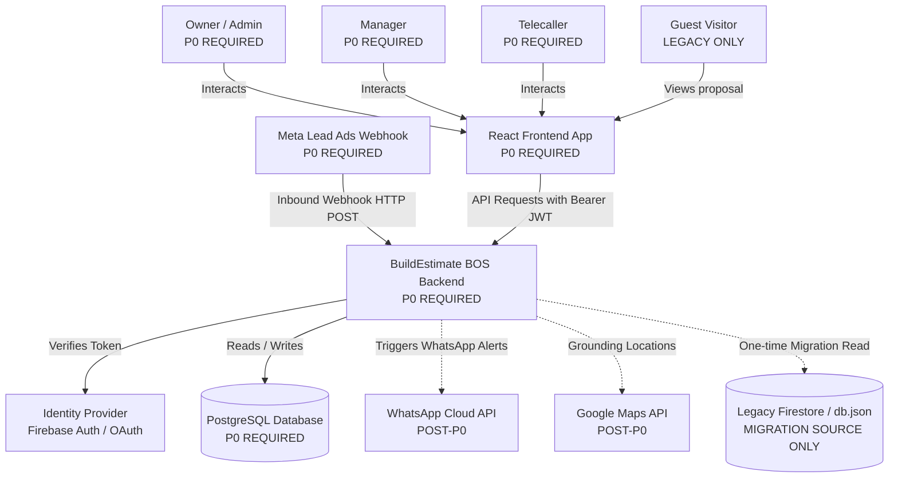
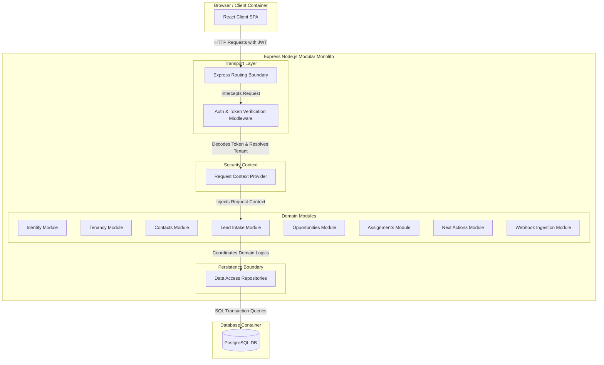
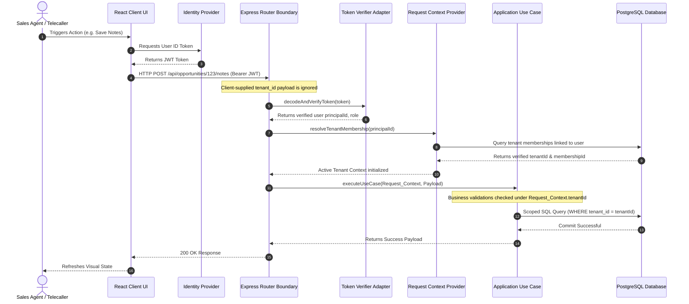
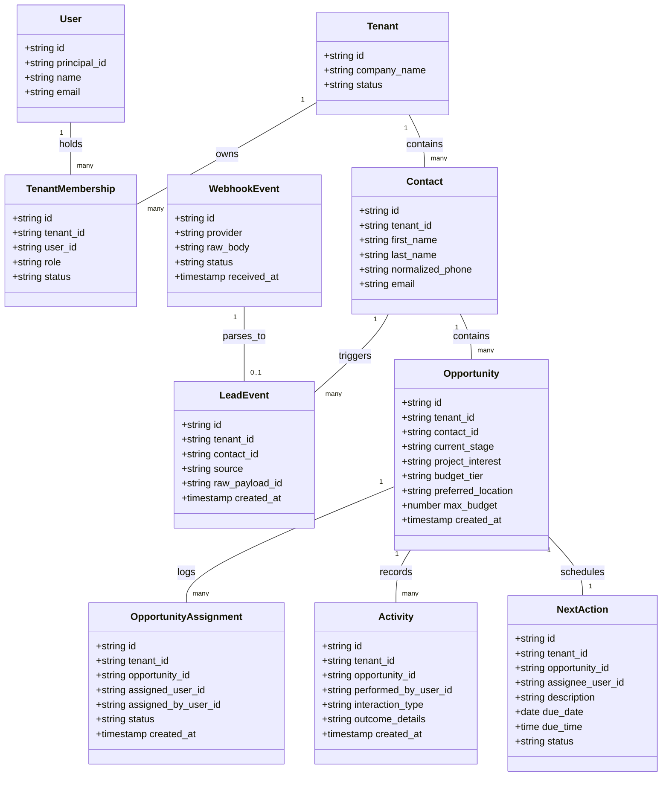
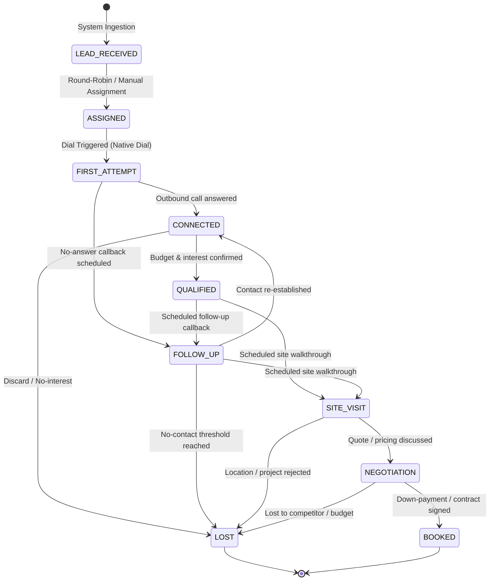
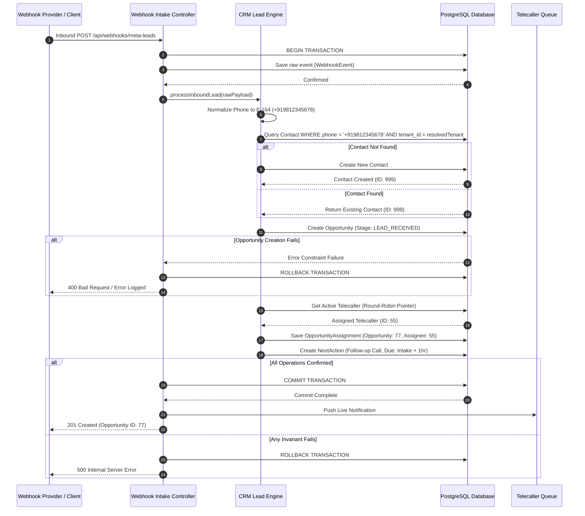
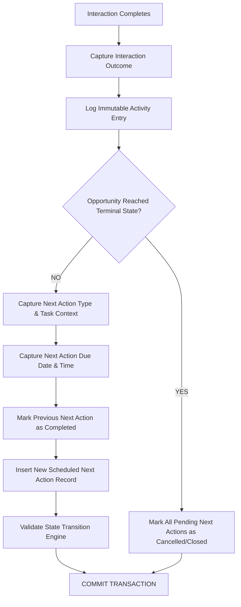

# ARCH-001: Minimum Target Architecture and Coding Baseline

## 1. Executive Architecture Summary

This document establishes the frozen **Minimum Target Architecture** required to begin coding the first production slice of the **BuildEstimate BOS (Business Operating System)**. The primary objective is to define a robust architectural baseline, decoupling domain logic from both the presentation layer and volatile third-party integrations. This design ensures server-authoritative tenant isolation, transaction safety, and a reliable sales workflow.

### Architectural Blueprint Summary
*   **Architecture Style**: Monolithic Core (Modular Monolith)
*   **Frontend**: React + TypeScript (Vite), migrated to communicate exclusively via backend REST APIs.
*   **Backend**: Node.js + TypeScript, compiled to unified execution targets via `esbuild`.
*   **Primary Database**: PostgreSQL (relational database).
*   **Authoritative Persistence Boundary**: Server REST API only. Direct client-side Firestore writes are deprecated and planned for complete removal.
*   **Tenant Isolation Boundary**: Server-derived Tenant Context parsed from verified JWT session payloads.
*   **Authentication Abstraction**: Token Verifier Adapter mapping incoming Identity Provider tokens to verified Application User and Tenant Membership principal contexts.
*   **First Vertical Slice**: Automated end-to-end CRM lead ingestion (`LEAD_RECEIVED` ➡️ `ASSIGNED` ➡️ `MANDATORY_NEXT_ACTION_CREATED` ➡️ `TELECALLER_QUEUE_AVAILABILITY`).
*   **Technologies Deliberately Deferred**: PostgreSQL Row-Level Security (RLS), ORM choice, validation library choice, hosting environment, Redis integration, Message Brokers, production WhatsApp Cloud API, and Gemini Property Matching.

### Coding Readiness Verdict: READY
Auditing of the repository confirms that the codebase is **READY** to begin implementing the core backend modules. The current Node.js and Express development server is active, and the frontend React application provides complete layout elements. Implementing the target state requires writing decoupled, server-authoritative backend routes, adding PostgreSQL persistence adapters, and removing client-side direct writes to Firestore.

---

## 2. Architecture Principles

To prevent design regression and maintain structural containment during development, the following principles are enforced across all layers:

| Principle | Why It Exists | What It Prevents |
| :--- | :--- | :--- |
| **SERVER AUTHORITATIVE** | Ensures all validation, access control, state transitions, and database updates are mediated by backend code. | Prevents client-side script spoofing or data manipulation from bypassing business controls. |
| **TENANT CONTEXT IS SERVER-DERIVED** | The active Tenant ID is derived strictly from verified cryptographically signed JWT tokens decoded on the server. | Prevents cross-tenant data leakage and payload tempering. |
| **DOMAIN RULES ARE NOT UI RULES** | Business validation, state constraints, and transition mechanics are implemented within backend domain models. | Prevents visual validation layers from masking silent database anomalies or incomplete submissions. |
| **ACTIVE OPPORTUNITIES CANNOT SILENTLY LOSE THEIR NEXT ACTION** | Active sales journeys must always possess exactly one active, scheduled Next Action (follow-up task). | Prevents prospects from falling out of active pipelines or being neglected. |
| **HISTORY IS APPEND-ONLY** | Operational activities, touchpoints, and ownership changes are preserved in append-only tables. | Prevents modification of historical records or tampering with performance audit trails. |
| **EXTERNAL EVENTS ARE PERSISTED BEFORE PROCESSING** | All inbound webhook payloads (such as Meta Lead Ads) are written to a database log table before parsing. | Prevents lead loss due to network dropouts or backend crashes during execution. |
| **AI IS NOT REQUIRED FOR CORE BOS CORRECTNESS** | The application must remain fully operational and functional even if Gemini AI engines are offline or rate-limited. | Prevents core business blocks from stalling due to third-party API downtime. |
| **CLIENTS DO NOT DIRECTLY MUTATE BUSINESS DATABASES** | Frontend code communicates with the application database exclusively through backend-mediated REST API requests. | Exposing raw database endpoints, collection paths, or connection strings to the client browser. |
| **NO FABRICATED MIGRATION HISTORY** | Data migration scripts do not manufacture historical touchpoints, call records, or stages. | Prevents misleading audit trails and corrupt analytics tracking. |
| **P0 FAVORS A MODULAR MONOLITH OVER DISTRIBUTED COMPLEXITY** | Logic is organized as decoupled modules within a single codebase rather than split into multiple services. | Prevents over-engineering, latency, and operational overhead during early phases. |

---

## 3. System Context Diagram

The following diagram maps the high-level system boundaries and communications for the BuildEstimate BOS platform, separating P0 requirements, post-P0 modules, and legacy elements:



---

## 4. Target Container Architecture

The target modular backend container isolates routing, application logic, persistence, and external webhook ingestion interfaces:



---

## 5. Modular Monolith Boundaries

Backend functionality is organized into distinct domain modules to prevent tight coupling. Utility folders (like `services/` or `helpers/`) are avoided as primary architectural boundaries.

### 5.1 Identity Module
*   **Responsibility**: Converts incoming Bearer JWT tokens into validated system principals and validates active application user statuses.
*   **Owns**: User Credentials Lookup, Token Validation Adapters.
*   **May Read**: Tenancy (to check tenant association).
*   **May Write**: None.
*   **Must Not Own**: Opportunities, Contacts, or Next Actions.

### 5.2 Tenancy Module
*   **Responsibility**: Manages Tenant configuration, license gates, user memberships, and subscription statuses.
*   **Owns**: Tenants, Tenant Memberships (linking users to tenants).
*   **May Read**: Identity.
*   **May Write**: Tenant configuration.
*   **Must Not Own**: Contacts, Opportunities, or Webhook Logs.

### 5.3 Contacts Module
*   **Responsibility**: Standardizes E.164 phone formats and manages unique contact cards scoped to active tenants.
*   **Owns**: Contacts.
*   **May Read**: Tenancy.
*   **May Write**: Contacts.
*   **Must Not Own**: Assignments or Next Actions.

### 5.4 Lead Intake Module
*   **Responsibility**: Coordinates inbound lead processing from webhooks or manual entries, initiating phone normalization and contact lookup.
*   **Owns**: Raw Intake Payloads, Lead Events.
*   **May Read**: Contacts, Tenancy.
*   **May Write**: Lead Events.
*   **Must Not Own**: Webhook Event payloads.

### 5.5 Opportunities Module
*   **Responsibility**: Manages active commercial pipelines, budget evaluations, stage progression, and transition validations.
*   **Owns**: Opportunities.
*   **May Read**: Contacts, Tenancy, Assignments.
*   **May Write**: Opportunities.
*   **Must Not Own**: Raw Inbound Webhook Logs.

### 5.6 Assignments Module
*   **Responsibility**: Manages telecaller queues, active status checks, and round-robin pointer persistence.
*   **Owns**: Assignment History Log, Round-Robin Pointer state.
*   **May Read**: Tenancy, Identity.
*   **May Write**: Round-Robin Pointer.
*   **Must Not Own**: Opportunities or Contacts.

### 5.7 Next Actions Module
*   **Responsibility**: Enforces scheduling, status updates, completion boundaries, and overdue tracking of next follow-up actions.
*   **Owns**: Next Actions.
*   **May Read**: Opportunities, Tenancy.
*   **May Write**: Next Actions.
*   **Must Not Own**: Telecaller Attendance.

### 5.8 Webhook Ingestion Module
*   **Responsibility**: Exposes endpoints to ingest raw external payloads (such as Meta Ads) and logs them immediately to an immutable table.
*   **Owns**: Webhook Events.
*   **May Read**: None.
*   **May Write**: Webhook Events.
*   **Must Not Own**: Lead Events or Opportunity records.

---

## 6. Layer Responsibilities

The system enforces strict directional dependencies across its functional layers. Flow must travel from the Transport Layer down to the Persistence Layer:

```
Transport Layer (HTTP) ──► Application Layer ──► Domain Layer ──► Persistence Layer
```

### 6.1 HTTP / Transport Layer
*   **May Do**: Accept REST API calls, validate request body schemas, extract JWT tokens, instantiate Request Contexts, and format JSON payloads for responses.
*   **Must Not Do**: Run SQL queries, execute business logic mutations, bypass authentication filters, or directly access database connections.

### 6.2 Application Layer
*   **May Do**: Coordinate domain events, handle system transactions, call external service adapters (Meta, Maps), and dispatch notifications.
*   **Must Not Do**: Contain core business validation rules, bypass tenant context, or manipulate database connection threads.

### 6.3 Domain Layer
*   **May Do**: Enforce state invariants, check status transition machines, validate phone uniqueness constraints, and manage next-action validations.
*   **Must Not Do**: Handle HTTP request objects, format web responses, or directly read database connections.

### 6.4 Persistence Layer
*   **May Do**: Map database records to domain entities, execute SQL queries within transactions, and encapsulate database-specific connection pools.
*   **Must Not Do**: Make API calls, decode JWT auth tokens, or evaluate business transition rules.

### 6.5 Integration Layer
*   **May Do**: Dispatch outgoing payloads to external providers and wrap API-specific SDK elements.
*   **Must Not Do**: Directly update database tables or bypass validation modules.

---

## 7. Authenticated Request Flow

The following sequence diagram traces how request authorization and tenant isolation are enforced before executing database mutations. **Any client-supplied tenant identifier is ignored**:



---

## 8. Request Context Contract

The Request Context contract is a immutable, server-derived data structure injected into every API request, serving as the source of truth for authorization and tenant containment:

```typescript
export interface RequestContext {
  readonly requestId: string;         // Unique Correlation ID generated per request (UUIDv4)
  readonly principalId: string;       // Unique ID resolved from token signature validation (e.g. Firebase User UID)
  readonly applicationUserId: string; // Primay Key mapping to application users table in PostgreSQL
  readonly tenantId: string;          // Cryptographically resolved target Tenant ID
  readonly membershipId: string;      // ID linking the current user to the target tenant scope
  readonly role: 'Owner' | 'Manager' | 'Supervisor' | 'Telecaller'; // Verified role claims resolved on the server
}
```

*   **Security Principle**: No property inside this contract can be populated or modified by client-supplied payload parameters. Any client-provided `tenant_id` or `role` variables are discarded.

---

## 9. Tenant Isolation Model

The P0 tenant security architecture enforces strict separation using logical server-side scoping. PostgreSQL Row-Level Security (RLS) is not required to begin coding, but tenant isolation must be enforced on every transaction:

*   **One Active Membership Per User**: In P0, an application user is associated with exactly one active builder tenant at a time.
*   **Database Constraints**: Every database table containing tenant-owned data (Contacts, Opportunities, Next Actions, etc.) must include a `tenant_id` attribute.
*   **Scoping Mandate**: All database queries and mutations executed by the Persistence Layer must explicitly scope operations using `WHERE tenant_id = RequestContext.tenantId`.
*   **Tenant Payload Discard**: If a client attempts to supply a `tenant_id` in the request body, query parameter, or headers, the API discard filter intercepts and deletes it before routing.
*   **Cross-Tenant Isolation Testing**: The test suite must include integration tests that explicitly attempt to read or modify records using spoofed tenant context tokens, validating that the API denies access.

---

## 10. Minimum Domain Model

The conceptual entity relations for the core business structures are modeled below. This design decouples contacts, active pipelines, assignments, and scheduled tasks:



---

## 11. Opportunity State Machine

The active sales pipeline is governed by a strict state machine, preventing telecallers from skipping stages or making invalid status updates:



### State Machine Transition Rules
*   **Active States**: `LEAD_RECEIVED`, `ASSIGNED`, `FIRST_ATTEMPT`, `CONNECTED`, `QUALIFIED`, `FOLLOW_UP`, `SITE_VISIT`, `NEGOTIATION`.
*   **Terminal States**: `BOOKED`, `LOST`.
*   **Backward Transitions**: Restricted. Demoting an Opportunity from `QUALIFIED` back to `LEAD_RECEIVED` is forbidden.
*   **Terminal Reopening**: Moving an Opportunity out of `BOOKED` or `LOST` requires supervisor or owner approval, logging a reason.
*   **Interaction Evidence Requirements**: Moving from `ASSIGNED` to `FIRST_ATTEMPT` requires call trigger metadata. Moving to `CONNECTED` requires call outcome log verification.

---

## 12. Core Business Invariants

The target system enforces the following business invariants, which cannot be bypassed by client actions:

| Invariant | Business Rule | Enforcement Layer | Transaction Requirement | Failure Behavior |
| :--- | :--- | :--- | :--- | :--- |
| **INV-01** | Every active Opportunity must possess exactly one active owner after assignment. | Service / Database DB | Required | Block mutation, rollback transaction, log warning. |
| **INV-02** | Every active Opportunity must have exactly one pending Next Action after an interaction completes. | Service Layer | Required | Rollback state update, restore previous Next Action, reject client request. |
| **INV-03** | Every completed telecaller interaction creates an immutable Activity log entry. | Service Layer | Required | Reject transaction, alert client, block status update. |
| **INV-04** | Every assignment change creates an immutable OpportunityAssignment history record. | Service / Triggers | Required | Revert assignment, alert supervisor. |
| **INV-05** | Contact duplicate checking is scoped strictly within the active Tenant's boundary. | Database Unique Constraint | Required | Reject create, trigger Contact Resolution flow. |
| **INV-06** | Client-supplied tenant IDs are discarded and never trusted. | Route Middleware | Non-Transactional | Intercept payload, extract ID from token. |
| **INV-07** | Inbound webhooks are logged as WebhookEvents before processing begins. | Controller Layer | Required | Terminate intake, return 500 error to Meta provider. |
| **INV-08** | Terminal Opportunities (`BOOKED`, `LOST`) must not retain active Next Actions. | Service Machine | Required | Clear/close all pending Next Action entries, mark completed. |

---

## 13. First Vertical Slice

The first production vertical slice implements the complete automated pipeline from lead intake to telecaller queue.

### LEAD RECEIVED ➡️ CONTACT RESOLVED ➡️ OPPORTUNITY CREATED ➡️ TELECALLER ASSIGNED ➡️ NEXT ACTION CREATED

*   **Trigger**: Meta Lead Ads Webhook Payload HTTP POST received at `/api/webhooks/meta-leads` (or manually inputted via the CRM Hub form).
*   **Input Data**:
    ```json
    {
      "lead_form_id": "meta-form-404",
      "customer_name": "Deepak Singh",
      "phone_number": "+91 98123-45678",
      "project_interest": "3 BHK Kharar Villa",
      "budget_tier": "50L - 75L"
    }
    ```
*   **Authorization**: For webhook events, Meta Signature validation. For manual entries, verified active User token context.
*   **Domain Operations**:
    1.  Log raw payload to `WebhookEvent`.
    2.  Normalize phone number to `E.164` format (`+919812345678`).
    3.  Resolve unique `Contact` within Tenant scope.
    4.  Create new `Opportunity` linked to Contact.
    5.  Filter active, logged-in telecallers; select next telecaller via sequential Round-Robin pointer.
    6.  Create an automated "Initial Contact" scheduled `NextAction` assigned to the telecaller, scheduled for 1 hour from intake.
*   **Transaction Boundary**: Steps 1–6 execute within a single PostgreSQL transaction block. If any step fails, the entire transaction rolls back, and the inbound lead remains in the raw webhook queue for reprocessing.
*   **Output Data**: Returns 201 Created with opportunity metadata. The lead appears in the assigned telecaller's mobile queue view.

---

## 14. First Vertical Slice Sequence Diagram

The following sequence diagram outlines the transaction boundary and rollback mechanics of the first vertical slice:



---

## 15. Transaction Boundaries

To prevent orphaned records and incomplete state, the following workflows are bound inside database transactions:

### A. Lead Intake Transaction
*   **Operations Included**: WebhookEvent creation, Phone Normalization, Contact Lookup/Create, Opportunity creation, Round-Robin selection, Assignment logging, and initial NextAction creation.
*   **Commit Condition**: All steps execute without constraint violations.
*   **Rollback Condition**: Phone format errors, missing active telecallers (if fallback assignment fails), database write timeouts, or opportunity schema mismatches.

### B. Post-Interaction Resolution Transaction
*   **Operations Included**: Complete old NextAction, Create Activity record, execute Opportunity stage transition validation, create new scheduled NextAction, and update Opportunity metadata.
*   **Commit Condition**: Successful save of both Activity and NextAction records.
*   **Rollback Condition**: Attempting to complete an action without scheduling a follow-up, providing a description, or supplying a valid date/time.

### C. Reassignment Transaction
*   **Operations Included**: Overwrite `assigned_to_caller_id` on Opportunity, append a record to `OpportunityAssignment` history, and reschedule pending `NextAction` assignees.
*   **Commit Condition**: Assignment logged and NextAction assignee updated.
*   **Rollback Condition**: Assigning to an inactive/disabled user profile.

---

## 16. Contact Resolution Boundary

Prospect phone uniqueness is resolved within the active tenant's scope, preventing team collision:

```
                  ┌──────────────────────┐
                  │ Inbound Raw Phone    │
                  └──────────┬───────────┘
                             ▼
                  ┌──────────────────────┐
                  │ Normalize to E.164   │
                  └──────────┬───────────┘
                             ▼
            ┌─────────────────────────────────┐
            │ Query Contact within Tenant_ID  │
            └───────────────┬─────────────────┘
                            ▼
                    Exist in Tenant?
                     /            \
                  YES              NO
                   /                \
      ┌─────────────────────┐    ┌─────────────────────┐
      │ Existing Opportunity│    │ Create New Contact  │
      │ Context Checked     │    │ ID: New_Contact     │
      └──────────┬──────────┘    └─────────────────────┘
                 ▼
          Open Opportunity?
           /            \
        YES              NO
         /                \
┌──────────────────┐ ┌──────────────────┐
│ Append activity  │ │ Create New       │
│ to current Lead  │ │ Opportunity      │
└──────────────────┘ └──────────────────┘
```

*   **Deduplication Policy**: Matching phone numbers do not automatically merge unrelated historic contacts if the name differs significantly (e.g., "Amit Kumar" vs "Sanjay Gupta" sharing a business landline). Instead, the system tags the transaction with `POTENTIAL_AMBIGUOUS_MATCH` and routes it to a manager's verification backlog.

---

## 17. Assignment Architecture

The target assignment architecture guarantees deterministic and fair lead routing:

*   **Active Telecallers Filter**: Active assignments filter profiles with user_role `Telecaller` and status `Active`.
*   **Pointer Durability**: The sequential allocation index pointer must be persisted in a database table (`round_robin_pointers`), preventing index resets when Node servers recycle.
*   **Zero-Telecaller Fallback**: If no active telecaller is registered, the assignment engine assigns the lead to the tenant's primary Owner, appending an audit flag: `"No active telecallers found; assigned to Owner fallback"`.
*   **Concurrency Locks**: Select pointer queries use `SELECT FOR UPDATE` to block race conditions during high-concurrency webhook hits.

---

## 18. Next Action Architecture

Next Action is modeled as a first-class relational entity to prevent opportunities from being abandoned:

```typescript
export interface TargetNextAction {
  id: string;
  tenant_id: string;
  opportunity_id: string;
  assignee_user_id: string;
  action_type: 'Initial_Call' | 'Followup_Callback' | 'Site_Visit' | 'Negotiation_Review';
  task_description: string; // Detailed notes explaining specific context
  due_date: string;         // YYYY-MM-DD
  due_time: string;         // HH:MM (24-hour format)
  status: 'Pending' | 'Completed' | 'Rescheduled' | 'Cancelled';
  created_at: string;
}
```

*   **Enforcement Invariant**: Every active opportunity must have exactly one scheduled, pending `NextAction`. The database schema enforces a composite status indicator validating this rule before committing mutations.

---

## 19. Post-Interaction Resolution Flow

The following diagram tracks the mandatory post-interaction sequence. The UI is blocked from closing the interaction until the full loop is submitted:



---

## 20. Meta Lead Ads P0 Boundary

Production Meta Lead Ads webhook ingestion is a **P0 REQUIRED** component. Webhook payloads must be processed reliably:

```
┌────────────────────────────────────────────────────────┐
│                        Meta API                        │
└──────────────────────────┬─────────────────────────────┘
                           ▼ Webhook HTTP POST
┌────────────────────────────────────────────────────────┐
│               Webhook Ingestion Endpoint               │
└──────────────────────────┬─────────────────────────────┘
                           ▼ Write Raw Body
┌────────────────────────────────────────────────────────┐
│                WebhookEvent Database Log               │
└──────────────────────────┬─────────────────────────────┘
                           ▼ Execute CRM Lead Pipeline
┌────────────────────────────────────────────────────────┐
│                 CRM Lead Ingestion Task                │
└────────────────────────────────────────────────────────┘
```

*   **P0 Webhook Scope**: The Webhook Event Log, Signature Validation, and Idempotency Check are required in P0.
*   **First Coding Slice Integration**: The first vertical slice may be tested using mock payloads and manual CRM forms before connecting the live Facebook Graph endpoints.

---

## 21. Failure Model

The system isolates external API or database connection failures using structured recovery pathways:

| Failure Event | UI Visibility | Policy Classification | Recovery Pathway & Code Pattern |
| :--- | :--- | :--- | :--- |
| **Authentication Fail** | Visible Error Toast | **REJECT** | Invalidate current session token, block routing, and redirect client to login. |
| **Tenant Lookup Fail**| Blank State Error | **REJECT** | Log security trace, block API access, and deny read/write operations. |
| **Duplicate Webhook** | None (Silent) | **REJECT** | Deduplicate payload using the incoming Meta lead ID. Return `200 OK` to prevent retries. |
| **Malformed Lead** | None (Log warning) | **DEAD-LETTER CANDIDATE**| Write payload to log table with status `'Malformed'`, alert admin dashboard, and abort pipeline. |
| **Database Offline** | Retry Prompt Screen | **RETRY** | Database connection pool buffers requests temporarily. Client displays connection error prompt. |
| **Assignment Offline** | Silent Fallback | **DEFER** | Assign lead to primary Tenant Owner fallback. Skip round-robin. |
| **Transaction Failure**| Visible Error Notification | **REJECT** | Roll back all uncommitted operations, restore original state, and notify the user. |

---

## 22. Initial Codebase Structure

The target modular codebase structure isolates domains within the existing Express and React layout:

```
├── docs/                      # Architectural and API documentation
│   ├── current-state/         # Completed current-state system audits
│   └── architecture/          # ARCH-001 target blueprint configurations
├── server/                    # Target Backend Source Code
│   ├── index.ts               # Express Server Entrypoint
│   ├── middleware/            # Security and Request Context Middlewares
│   │   ├── auth.ts            # Bearer JWT Validation Adapter
│   │   └── tenant.ts          # Server-side Tenant Isolation Resolver
│   ├── db/                    # PostgreSQL Database and Connection Pools
│   │   ├── schema.ts          # Normalized SQL Schema Models
│   │   └── connection.ts      # Connection Pool Configurations
│   └── modules/               # Modular Monolith Domain Verticals
│       ├── identity/          # Users and Roles lookup
│       ├── tenancy/           # Tenant isolated boundaries
│       ├── contacts/          # E.164 standardized contacts
│       ├── lead-intake/       # Inbound CRM leads processors
│       ├── opportunities/     # CRM State Transition Engine
│       ├── next-actions/      # Relational follow-up enforcer
│       └── webhooks/          # Immutable webhook ingestion endpoint
├── src/                       # Frontend React Application
│   ├── components/            # Isolated UI Elements
│   │   ├── CRMLeadHub.tsx     # Modern CRM inquiry layout
│   │   └── MobileLeadCard.tsx # Telecaller focused queue dashboard
│   ├── App.tsx                # Main Router (REST-only integration)
│   └── types.ts               # Decomposed UI Interfaces
├── package.json               # Backend compiled build directives
└── tsconfig.json              # TypeScript compiling configurations
```

---

## 23. Migration Coexistence Rule

To prevent split-brain states and data corruption during the migration phase, the following operational rules are enforced:

*   **Authoritative Master**: PostgreSQL functions as the master database for all target CRM workflows.
*   **Firestore is Read-Only**: The legacy Firestore subcollections are read-only migration sources. Direct browser writes to Firestore are removed.
*   **No Uncontrolled Dual-Writes**: No single transaction or mutation is written to both databases simultaneously. The systems operate in separation.
*   **`db.json` Exclusion**: The legacy filesystem database is bypassed and ignored by all new modular business workflows.

---

## 24. Testing Baseline before Feature Expansion

The system requires automated tests for the first vertical slice:

*   **INV-01 Unit Test**: Validate that creating an Opportunity without an assignee throws an error.
*   **INV-02 Integration Test**: Validate that attempting to resolve an interaction without scheduling a future Next Action throws a constraint violation and rolls back the transaction.
*   **Tenant Isolation Test**: Execute parallel database requests using Tenant A and Tenant B context, verifying that Tenant A cannot access, update, or read Tenant B's contacts.
*   **Contact Duplication Test**: Verify that writing an existing phone number under the same tenant scopes to the single Contact ID, while writing the same phone under a different tenant creates a separate Contact.

---

## 25. Observability Baseline

Operational monitoring is integrated directly into the Monolith framework:

*   **Correlation IDs**: Every incoming API request is tagged with a unique `x-correlation-id` header UUIDv4, propagated through the request context to database logs.
*   **Structured Logs**: Console logs are outputted as structured, parseable JSON lines:
    ```json
    {"timestamp":"2026-07-08T11:02:00Z","correlationId":"uuid-99","level":"INFO","module":"lead-intake","message":"Lead parsed and phone normalized successfully"}
    ```
*   **Access Denial Trace**: All failed token validation attempts or unauthorized access attempts are logged as high-priority warning entries.

---

## 26. Deliberately Deferred Decisions

The following choices are deliberately deferred to focus on core domain development:

| Deferred Decision | Rationale | Trigger for Decision | Mitigation Abstraction Boundary |
| :--- | :--- | :--- | :--- |
| **ORM Selection** | Avoid locking into SQL tooling before schema constraints are validated. | CODE-002 (PostgreSQL Persistence Foundation). | Abstract repository interfaces mapping raw database rows to domain objects. |
| **Validation Library** | Prevent syntax dependency overhead on data transfer objects. | CODE-001 (BOS Backend Foundation). | Custom TypeScript interfaces and regex validators. |
| **Final Auth Provider** | Retaining Firebase Auth client popups is the fastest path for early releases. | Pilot user deployment. | Decoupled Token Verifier Adapter middleware. |
| **PostgreSQL RLS** | Logical query-level scoping is sufficient to validate core CRM isolation. | Production security audit. | Enforce `tenant_id` column parameters on all repository queries. |
| **Message Brokers** | In-memory asynchronous event processing handles P0 intake volumes easily. | High-volume Meta Lead ad scale-up. | Decoupled Application Event Handlers. |
| **Observability Vendor** | Standard Winston/Morgan JSON stdout is easily parsed by cloud runtime collectors. | System launch. | Global Log Provider interface. |

---

## 27. Coding Readiness Gate

The system components are audited for coding readiness:

*   **Backend Foundation**: **READY TO CODE** (Express app structure is active; ready for modular routes).
*   **PostgreSQL Connection**: **READY WITH CONDITION** (Requires database schema specification).
*   **Authentication Abstraction**: **READY TO CODE** (Token verifier adapters can be built as Express middleware).
*   **Tenant Context**: **READY TO CODE** (Decoupled Request Context can be injected).
*   **First Vertical Slice**: **READY TO CODE** (Schema, models, and boundaries are defined).
*   **Meta Production Integration**: **NOT READY** (Deferred until live webhook routing is configured).
*   **Advanced Reporting**: **NOT READY** (Deferred until SQL databases are fully populated).

---

## 28. First Implementation Task Breakdown

The following sequence outlines the implementation tasks for the core CRM module:

```
CODE-001 (Monolith Core) ──► CODE-002 (PostgreSQL Schema) ──► CODE-003 (Auth Middleware)
                                                                   │
┌──────────────────────────────────────────────────────────────────┘
▼
CODE-004 (Standardization) ──► CODE-005 (Intake Routes) ──► CODE-006 (Round-Robin)
                                                                   │
┌──────────────────────────────────────────────────────────────────┘
▼
CODE-007 (Next Actions) ──► CODE-008 (Telecaller UI) ──► CODE-009 (Integration Tests)
```

### 28.1 CODE-001: Monolith Core and Router Layout
*   **Objective**: Configure the Express server to support domain-grouped modular folders under `/server/modules/`, avoiding flat routing folders.
*   **Dependencies**: None.
*   **Output**: Structured directories and routing registration loops.
*   **Acceptance Criteria**: Express starts up and serves route maps without dependencies.

### 28.2 CODE-002: PostgreSQL Persistence Foundation
*   **Objective**: Build database connection pool handlers, schema definitions for core tables (Tenant, User, Contact, Opportunity, Assignment, NextAction), and migration controllers.
*   **Dependencies**: CODE-001.
*   **Output**: Database schema files and initialization scripts.
*   **Acceptance Criteria**: Local PostgreSQL database initiates tables with constraints.

### 28.3 CODE-003: Authentication Principal and Tenant Context
*   **Objective**: Implement Token Verifier Adapters and Request Context middlewares to decode client JWTs and resolve tenant memberships.
*   **Dependencies**: CODE-002.
*   **Output**: Verification middlewares.
*   **Acceptance Criteria**: Secure API endpoints reject unauthenticated requests and correctly parse the active `tenantId`.

### 28.4 CODE-004: Contact Resolution and Phone Normalization
*   **Objective**: Implement standard E.164 formatting and unique duplicate checking scoped to active tenants.
*   **Dependencies**: CODE-003.
*   **Output**: Contacts domain controller.
*   **Acceptance Criteria**: Normalized contacts are lookup-resolved without duplicates.

### 28.5 CODE-005: Lead Ingestion and Opportunity Creation
*   **Objective**: Build the REST route for lead intake, creating Opportunities linked to Contacts.
*   **Dependencies**: CODE-004.
*   **Output**: Opportunity domain controller.
*   **Acceptance Criteria**: POST requests create Opportunity rows linked to resolved contacts.

### 28.6 CODE-006: Round-Robin Allocator and Pointer Persistence
*   **Objective**: Implement persistent sequential assignment routing for active telecallers.
*   **Dependencies**: CODE-005.
*   **Output**: Assignments domain controller.
*   **Acceptance Criteria**: Pointers persist across restarts and assign leads sequentially.

### 28.7 CODE-007: Mandatory Next Action Scheduling
*   **Objective**: Enforce the invariant requiring exactly one pending Next Action per Opportunity.
*   **Dependencies**: CODE-006.
*   **Output**: Next Action domain controller.
*   **Acceptance Criteria**: Opportunities cannot be updated without scheduling a valid Next Action.

### 28.8 CODE-008: Telecaller Queue API
*   **Objective**: Build REST API endpoints for telecallers to retrieve their assigned active opportunities and pending Next Actions.
*   **Dependencies**: CODE-007.
*   **Output**: Telecaller controller.
*   **Acceptance Criteria**: Returns assigned opportunities and pending tasks, sorted by date and time.

### 28.9 CODE-009: Integration Testing
*   **Objective**: Implement automated integration tests validating cross-tenant isolation, rollback, and duplicate check constraints.
*   **Dependencies**: CODE-008.
*   **Output**: Test suite.
*   **Acceptance Criteria**: Running tests compiles and passes validation checks.

---

## 29. Architecture Decisions Locked by ARCH-001

### LOCKED NOW
1.  **Server-Authoritative Validation**: All database writes, validations, and transitions are processed on the server.
2.  **Server-Derived Tenant Scoping**: The active Tenant context is derived strictly from verified JWT tokens decoded on the server.
3.  **Strict State Machine**: Opportunities progress through a validated state-machine lifecycle (`LEAD_RECEIVED` ➡️ `ASSIGNED` ➡️ `FIRST_ATTEMPT` ➡️ `CONNECTED` ➡️ `QUALIFIED` ➡️ `FOLLOW_UP` ➡️ `SITE_VISIT` ➡️ `NEGOTIATION` ➡️ `BOOKED / LOST`).
4.  **Persistent Round-Robin**: Allocator indexes are stored persistently in the database, preventing pointer resets.
5.  **Unique Scoped Contacts**: Duplicate checking enforces unique `(tenant_id, normalized_phone)` keys in the database.
6.  **Next Action Invariant**: Active Opportunities must have exactly one scheduled, pending follow-up action.
7.  **Inbound Webhook Logging**: External payload webhooks are written to an immutable log before processing.
8.  **Complete Firestore Deprecation**: Firestore direct writes and proxy stores are removed for core CRM data.

### DEFERRED
1.  **ORM Choice** (Deferred until CODE-002).
2.  **Validation Library Choice** (Deferred until CODE-001).
3.  **Final Auth Provider** (Deferred until target production deployment).
4.  **PostgreSQL Row-Level Security** (Deferred until security audit).
5.  **Redis Integration** (Deferred until high-scale pipeline deployment).
6.  **Observability Vendor** (Deferred until operations phase).

### STILL BLOCKING
None. All major architectural boundaries and implementation paths are resolved.

---

## 30. Coding readiness decision

Can the implementation of the first production vertical slice of BuildEstimate BOS begin safely under this target baseline?

### **YES**

The Minimum Target Architecture successfully isolates and defines all critical security boundaries, transactional invariants, and modular structures. Development can proceed immediately to **CODE-001: Monolith Core and Router Layout**.
